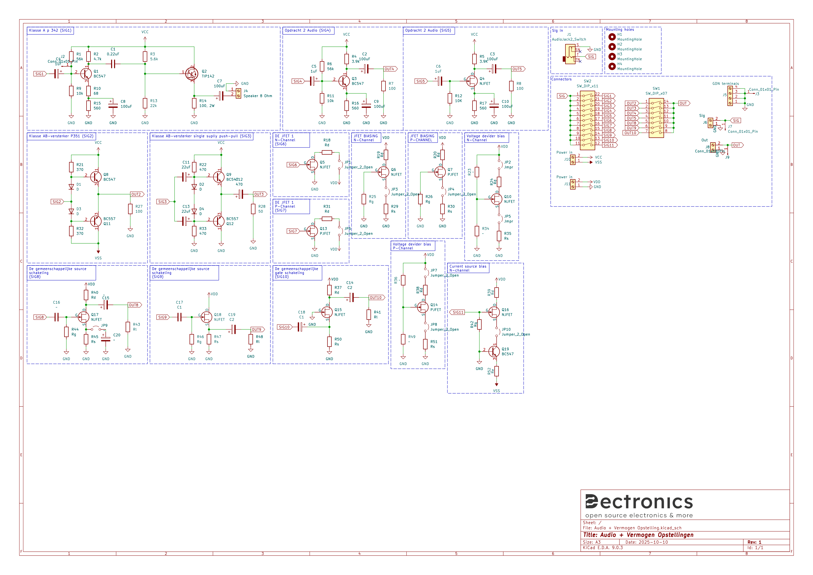

# Audio1-Labo-Opstelling

Complete printplaat met alle schakelingen van zowel versterkers (klasse a, en ab) en jfets @Vives kortrijk.
Met een printbare voet voor betere stabiliteit en geen kortsluiting te krijgen.
Op deze voet wordt er gewerkt met heated inserts (M3) voor het monteren van de print.

Het schema is als volgt:

Voor het solderen kan je gebruikmaken van de meegeleverde BOM file, de printplaat is een mix van SMD en TH componenten.

